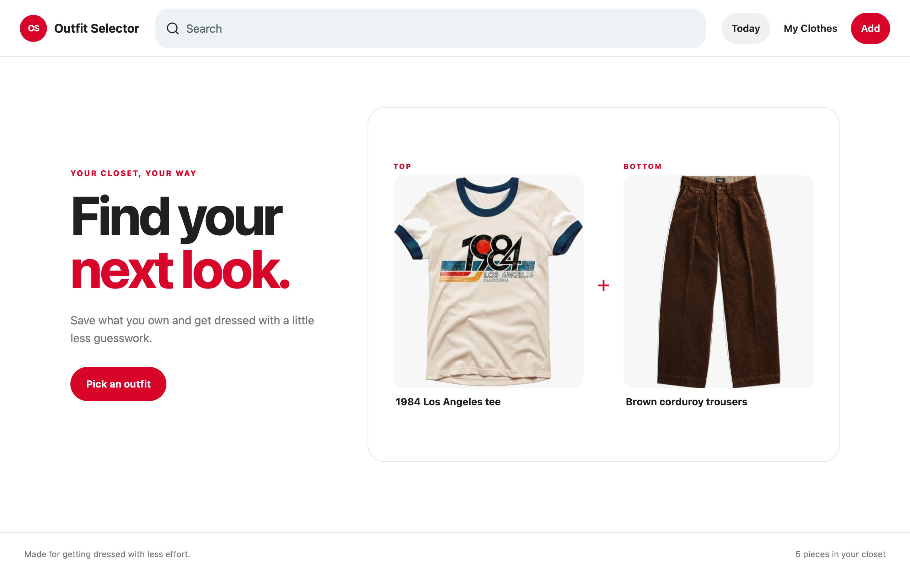
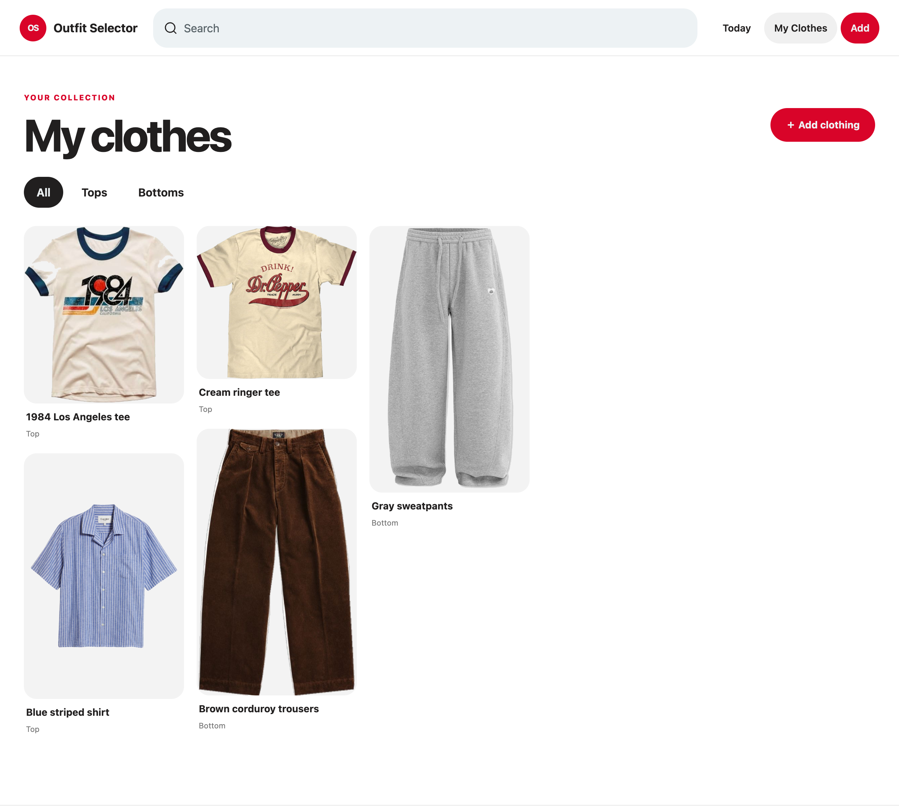
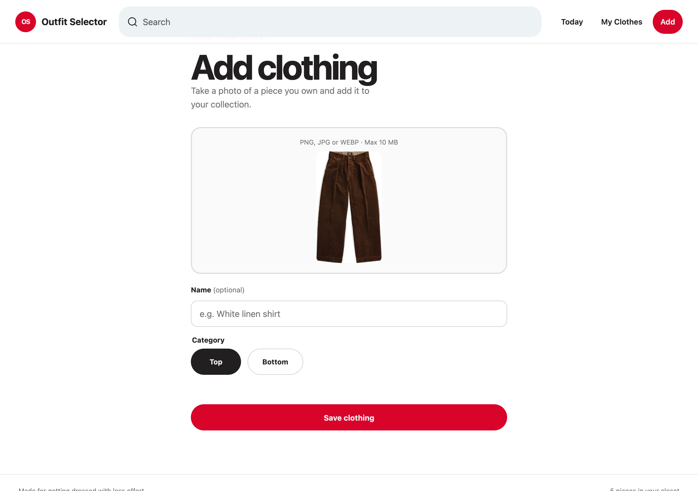
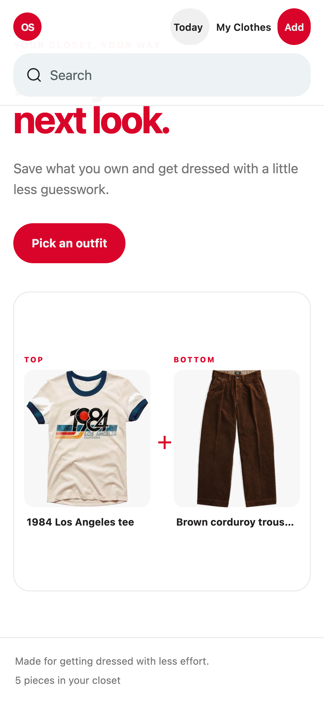

# Outfit Selector

Pick what to wear from photos of your own clothes. One photo per piece, saved as a top or a bottom. Ask for a suggestion, get one of each.

**[Open the live demo](https://ningyizhu0.github.io/outfit-selector-beta-/)**



## What it does

- Save a photo of each piece you own, labelled as a top or a bottom.
- Photos are converted to PNG and the background is removed, so pieces sit cleanly on the page.
- Press one button and get a random top plus a random bottom.
- Search by name, or filter the closet to tops or bottoms only.
- Delete pieces you no longer want.
- Everything stays in the browser. No account, no server, no upload.

## Screenshots

| My clothes | Add clothing |
|---|---|
|  |  |

<p align="center">
  
</p>

## How the photo processing works

Every photo you save is processed in the browser before it is stored:

1. The image is drawn onto a canvas, scaled down so its longest edge is at most 1400 px.
2. The four corner pixels are sampled to estimate the background colour.
3. A flood fill starts from the image edges and clears every pixel close to that colour.
4. The canvas is exported as a PNG with transparency.

This works best when the piece is shot against a plain, evenly lit surface, such as a wall, a door, or a bedsheet, and when the garment does not touch the edge of the frame. Busy backgrounds, strong shadows, or a background colour close to the garment colour will leave some background behind.

## Run it locally

The site is three static files. Any static server works:

```bash
git clone https://github.com/ningyizhu0/outfit-selector-beta-.git
cd outfit-selector-beta-
python3 -m http.server 4180
```

Then open `http://localhost:4180`. There is no build step and no dependency to install.

Opening `index.html` directly from the file system also works in most browsers, but `http://localhost` is the reliable option.

## Where your data lives

Pieces are stored in IndexedDB under the database name `outfit-selector`. That means:

- The closet belongs to one browser on one device. Opening the site on another device shows an empty closet.
- Clearing site data, or using a private window, removes the saved pieces.
- Nothing is sent anywhere, because there is no backend to send it to.

## Files

```text
index.html   page structure
style.css    styling, including the masonry closet grid
app.js       storage, photo processing, and the suggestion logic
```

## Browser support

Needs IndexedDB, canvas, and `canvas.toBlob`. Current Chrome, Safari, Firefox, and Edge all work.
